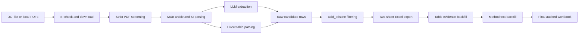

# AcidBiocharMiner

This repository contains a traceable, human-in-the-loop workflow for converting literature on acid-modified biochar and the corresponding pristine biochar into a structured two-sheet Excel dataset.

The workflow combines layout-aware document parsing, LLM-assisted extraction, direct Markdown-table parsing, sample-level filtering, conservative rule-based backfilling, row reconciliation, and audit logs. It treats the main article and its supplementary information (SI) as one evidence unit.

> Repository status: the production pipeline is included. The aggregate three-model benchmark scores are preserved in `evaluation/model_macro_metrics.csv`, but the ten-paper sampling manifest, annotation guide, gold-standard records, model predictions, and the exact field-matching evaluator still need to be added before the model-selection experiment is fully reproducible.

## Workflow



## Repository contents

- `llm_miner/`: adapted L2M3 agents, schemas, prompts, and result aggregation.
- `config/`: OpenAI-compatible model configurations. API keys are read from environment variables.
- `check_supplementary_by_doi.py` and `download_supplementary_from_check.py`: SI discovery and collection.
- `screen_pdf_for_extraction.py` and `collect_screened_pdfs.py`: rule-based extractability screening and file collection.
- `run_folder_main_si_extract.py` and `run_main_si_extract.py`: batch and single-paper main/SI orchestration.
- `run_pdf_demo.py` and `run_docx_demo.py`: PDF/DOCX parsing and LLM extraction.
- `direct_sheet1_parser.py` and `direct_sheet2_parser.py`: direct row extraction from Markdown tables.
- `target_row_filter.py`: acid/pristine/other/unknown classification.
- `export_target_excel.py`: normalization, sample-ID reconciliation, complementary-row merging, and two-sheet export.
- `backfill_*.py`: conservative evidence-based field completion.
- `run_fixed_extract_batch.sh` and `run_fixed_postprocess*.sh`: frozen production entry points.
- `docs/PIPELINE.md`: stage-by-stage inputs, outputs, and decision rules.
- `evaluation/`: model-comparison status and the materials still required for complete reproduction.
- `analysis/figure_scripts/`: statistical and plotting scripts for the structural-response and adsorption-performance figures, with method notes in `analysis/figure_scripts/methods/`.

## Installation

The frozen environment used Python 3.9.6. A clean virtual environment is recommended.

```bash
git clone https://github.com/2470224849-cell/AcidBiocharMiner.git
cd AcidBiocharMiner
python3 -m venv .venv
source .venv/bin/activate
python -m pip install --upgrade pip
python -m pip install -r requirements.txt
python -m pip install -e .
```

Docling may download model assets on first use. After those assets are cached, set `HF_HUB_OFFLINE=1` if a strictly offline run is required.

## API configuration

Do not write API keys into YAML files or commit them to Git. For the default DeepSeek-compatible configuration:

```bash
export DEEPSEEK_API_KEY="your-own-key"
```

The alternative configurations use `AIHUBMIX_API_KEY`. Provider aliases can change over time, so record the provider, resolved model identifier, access date, and configuration file for every benchmark run.

## Expected article layout

The frozen batch script searches recursively for main files matching `主文_*.pdf`. Place each article and its SI in the same paper folder, for example:

```text
data/articles/
└── paper_001/
    ├── 主文_paper_001.pdf
    ├── paper_001_supplement.pdf
    └── paper_001_mmc1.docx
```

The input articles are intentionally excluded from this repository because publisher PDFs and SI files may be copyright restricted.

On macOS, legacy `.doc` SI files are converted through the system `textutil` command. On Linux or Windows, convert `.doc` files to `.docx` before running this workflow.

## Run the pipeline

Optional pre-screening:

```bash
python screen_pdf_for_extraction.py \
  --input data/articles \
  --profile acid-biochar-strict \
  --out-json output/screening.json

python collect_screened_pdfs.py \
  --screening-json output/screening.json \
  --status PASS,MAYBE \
  --mode copy \
  --out-dir output/screened_articles
```

Frozen extraction, here shown for the first 20 papers:

```bash
bash run_fixed_extract_batch.sh 20 output/frozen_v1 data/articles
```

Frozen post-processing:

```bash
bash run_fixed_postprocess.sh output/frozen_v1
```

The primary final artifact is:

```text
output/frozen_v1/batch_main_plus_si_tables_FINAL.xlsx
```

Intermediate JSON, reader snapshots, per-stage workbooks, and detailed logs are retained locally for auditability but ignored by Git.

## Fixed production settings

The extraction wrapper fixes `pdf_parser=docling`, strict Docling failure behavior, `sample_filter=acid_pristine`, no extraction-stage backfill, no extraction-stage batch Excel merge, and resume with `skip_existing=true`.

The post-processing wrapper applies the following order:

1. two-sheet export from merged raw rows;
2. sheet 1 backfill from reader tables;
3. sheet 1 backfill from method text without global acid-field propagation;
4. sheet 2 method-text backfill with global propagation and room temperature mapped to 298.15 K.

## Reproducibility boundary

The code can reproduce the transformation workflow when the same source articles, model access, and provider behavior are available. It does not itself redistribute the article corpus. LLM services are external and may change; archival releases should therefore record model aliases, provider identifiers, dates, parameters, prompts, raw responses, and failure/retry logs.

The current aggregate benchmark table alone is not sufficient to validate model selection. See `evaluation/README.md` before describing the benchmark as independently reproducible.

## Attribution and license

This repository adapts the MIT-licensed [L2M3 project](https://github.com/Yeonghun1675/L2M3). The original license is retained in `LICENSE`, and adaptation details are recorded in `NOTICE.md`.

## Citation

For the upstream framework, cite:

> Harnessing Large Language Model to collect and analyze Metal-organic framework property dataset. *J. Am. Chem. Soc.* **2025**, 147, 3943–3958. https://doi.org/10.1021/jacs.4c11085

Add the citation for the acid-biochar study after the manuscript receives its final title, author list, and DOI.
